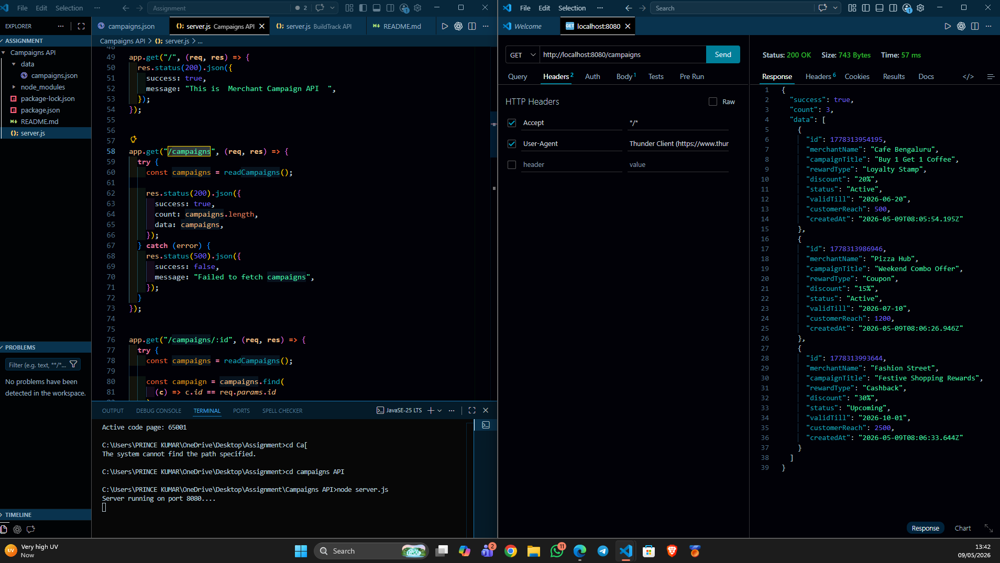
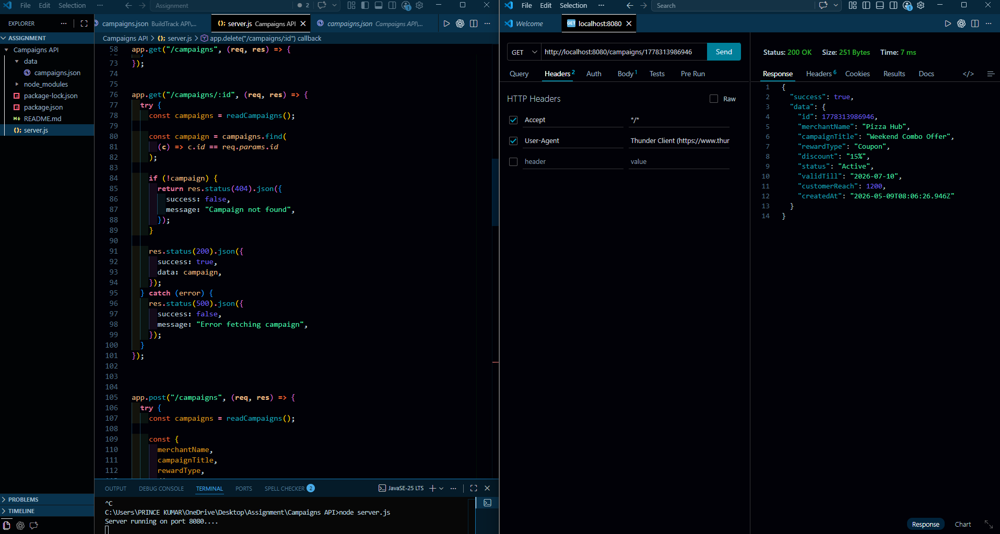
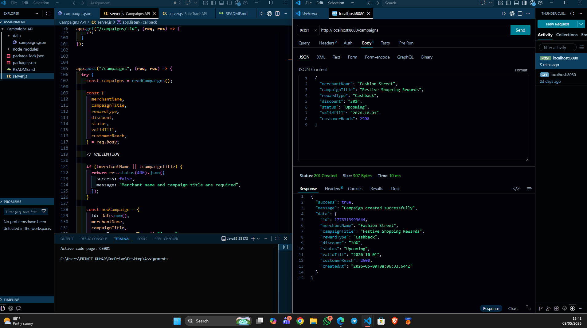
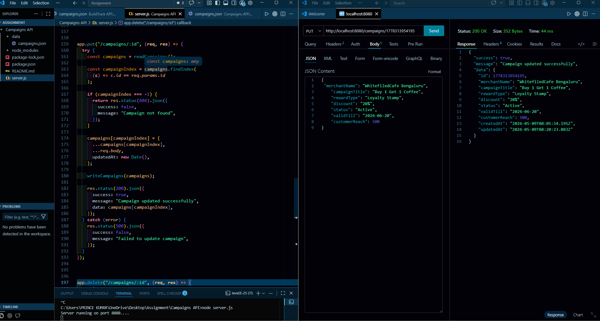
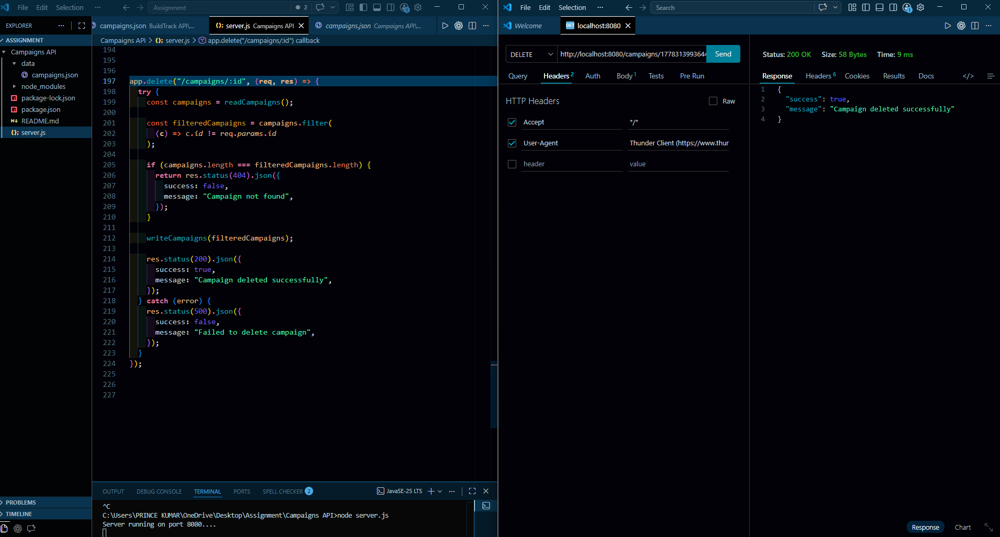
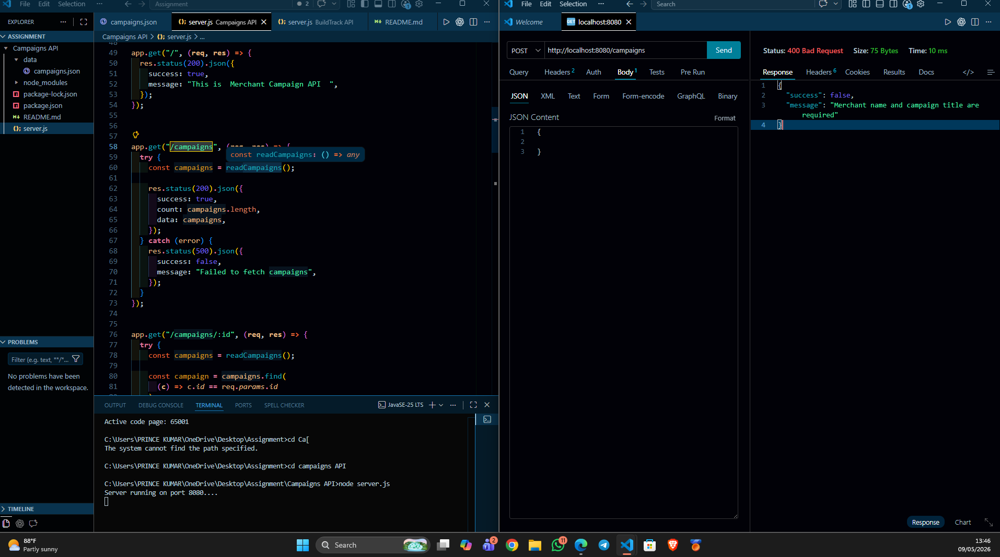

# Merchant Campaign Management API 🚀

A RESTful Campaign Management API built using Node.js and Express.js for managing merchant loyalty campaigns, rewards, and customer engagement offers.

This project is inspired by Kutoot’s merchant engagement and loyalty ecosystem and demonstrates a campaign management API for reward-based customer engagement.

The API provides CRUD operations for managing merchant campaigns and simulates real-world loyalty and promotional workflows.

---

# Live API

[https://your-render-link.onrender.com](https://campaigns-api-bmrb.onrender.com)

---

# Features

- Create merchant campaigns
- View all campaigns
- View single campaign
- Update campaign details
- Delete campaigns
- JSON file storage
- REST API architecture
- Error handling and validations

---

# Tech Stack

- Node.js
- Express.js
- File System (fs module)

---

# Project Structure

project-folder/
│
├── data/
│   └── campaigns.json
│
├── screenshots/
│   ├── get-campaigns.png
│   ├── get-single-campaign.png
│   ├── post-campaign.png
│   ├── update-campaign.png
│   ├── delete-campaign.png
│   └── validation-error.png
│
├── server.js
├── package.json
└── README.md

---

# Installation

## Clone Repository

```bash
git clone <[your-github-repo-link](https://github.com/inceprince/Campaigns-API)>
```

## Navigate To Project Folder

```bash
cd campaigns-api
```

## Install Dependencies

```bash
npm install
```

## Run Server

```bash
npm start
```

Server will run on:

```txt
http://localhost:8080
```

---

# API Endpoints

| Method | Endpoint | Description |
|--------|----------|-------------|
| GET | /campaigns | Get all campaigns |
| GET | /campaigns/:id | Get single campaign |
| POST | /campaigns | Create new campaign |
| PUT | /campaigns/:id | Update campaign |
| DELETE | /campaigns/:id | Delete campaign |

---

# Sample Request Body

```json
{
  "merchantName": "Cafe Bengaluru",
  "campaignTitle": "Buy 1 Get 1 Coffee",
  "rewardType": "Loyalty Stamp",
  "discount": "20%",
  "status": "Active",
  "validTill": "2026-06-20",
  "customerReach": 500
}
```

---

# API Testing Screenshots

## GET All Campaigns



---

## GET Single Campaign



---

## CREATE Campaign



---

## UPDATE Campaign



---

## DELETE Campaign



---

## Validation Error Handling



---

# Validation

The API validates:
- merchantName
- campaignTitle

If required fields are missing, the API returns proper JSON error responses.

Example:

```json
{
  "success": false,
  "message": "Merchant name and campaign title are required"
}
```

---

# Future Improvements

- MongoDB Integration
- Authentication & Authorization
- QR-based reward system
- Merchant Dashboard
- Customer Loyalty Points
- Campaign Analytics

---

# Author

Prince Singh

```
